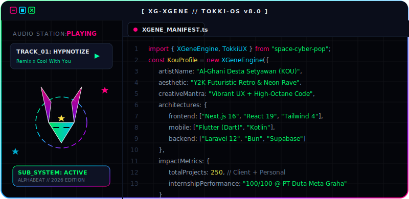
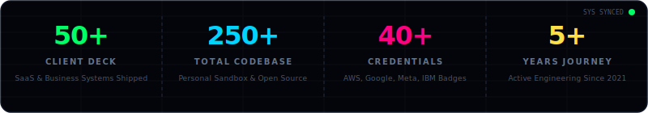
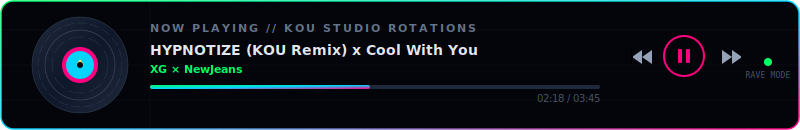
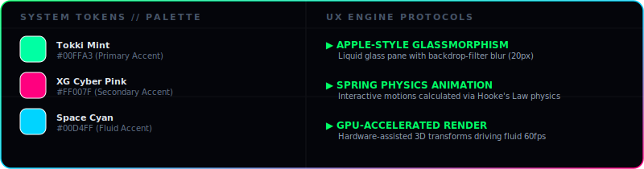

<div align="center">
  
<!-- Header Section: Responsive Animated Cyber-Pop IDE/Media Mockup (NewJeans Tokki + XG Cyber theme) -->


<br/>
<br/>

# 🛸 AL-GHANI DESTA SETYAWAN (KOU)
### ☄ `THE XGENE TOKKI // CREATIVE FRONT-END & UI/UX ARCHITECT`

*Membongkar batas antara UI/UX design premium bercita rasa Y2K-Retro dan engineering high-performance berkecepatan tinggi.*

[](https://github.com/fk0u?tab=followers)
[](https://github.com/fk0u)


<br/>
<br/>

<!-- Metrics Dashboard Panel -->


<br/>
<br/>

<!-- Custom Music Player Panel -->


</div>

---

## 💻 INTERACTIVE TERMINAL
> **Tip:** Klik pada baris perintah di bawah untuk mengeksekusi perintah dan mengeksplorasi data profil!

<details open>
<summary><b>⚡ guest@fk0u ~ % run-diagnostics --verbose --theme=newjeans-xg</b></summary>
<br/>

```ini
[================== TOKKI-OS v8.0 SYSTEM REPORT ==================]
 Hostname         : fk0u-workspace // XGENE-STATION
 Local IP         : 192.168.1.100 (LAN Chat Engine Ready)
 Location         : Samarinda, East Kalimantan, Indonesia
 Age / Status     : 16 y/o / Student @ SMKN 7 Samarinda (PPLG)
 Focus Area       : Pixel-Perfect Frontend, UX Physics, API Design
 Core Runtimes    : Node.js, Bun, PHP (Laravel 12), Dart (Flutter)
 UI/UX Aesthetic  : NewJeans-Inspired Y2K Pastel Glassmorphism 
                    fused with XG-Style Cyberpunk Neon & Metal Chrome
 Deployment       : Continuous Shipping (Vercel, Docker, VPS)
 Internship       : PT Duta Meta Graha (Software Engineer Intern)
 Internship Score : 100/100 (Perfect Performance Evaluation Score)
[=================================================================]
```

</details>

<details>
<summary><b>⚡ guest@fk0u ~ % cat design-tokens.json</b></summary>
<br/>

#### 🎨 Custom Design Tokens & UX Engine Protocols
Gue merancang antarmuka dengan konsistensi token dan prinsip visual yang ketat, memadukan nuansa Y2K Retro NewJeans dan Cyber-Pop XG:



</details>

<details>
<summary><b>⚡ guest@fk0u ~ % curl -s https://api.kou.it.com/metrics</b></summary>
<br/>

```json
{
  "status": "success",
  "data": {
    "development_years": "5+ years (started 2021)",
    "commercial_projects": 50,
    "personal_sandbox_projects": 200,
    "total_production_deploys": 250,
    "professional_certifications": 40,
    "academic_achievements": [
      "Juara 3 - LKS Web Technologies Kota Samarinda 2025",
      "Juara 1 - Web Design Competition SenTech Borneo 2024",
      "Juara 2 - Creative Content BI Provinsi Kaltim 2024",
      "Top 200 Nasional - Kompetensi Sains Ruangguru (Biologi)"
    ],
    "trusted_by": [
      "PT Duta Meta Graha",
      "SMK Negeri 7 Samarinda",
      "DISDIKBUD Kaltim",
      "Kominfo Kaltim",
      "Dicoding Indonesia"
    ]
  }
}
```

</details>

<details>
<summary><b>⚡ guest@fk0u ~ % npm run dev --projects=featured</b></summary>
<br/>

#### 🚀 Featured Products & Core Systems

##### 🛠️ [POLYFORGE](https://github.com/fk0u/polyforge)
*   **Tagline:** *Advanced Polyglot File Generator for Pentesting & CTF Bypass*
*   **Stack:** Next.js 16, TypeScript, Tailwind CSS, Framer Motion, PWA
*   **Engineering Deep Dive:** Dashboard weapon builder interaktif dengan Binary Forge viewer bawaan, entropy analyzer secara real-time, dan bypass tester. Dibuat khusus untuk pengujian keamanan format file bypass (PNG+PHP, MP4+ZIP) bagi komunitas CTF Indonesia.
*   🔗 [Live Web App](https://polyforge.lovable.app/) · [GitHub](https://github.com/fk0u/polyforge)

##### 📦 [Semakmur](https://github.com/fk0u/compro-semakmur)
*   **Tagline:** *The Leading B2B Export Marketplace connecting Indonesian SMEs to Global Buyers*
*   **Stack:** Laravel 12, React 19, Inertia.js 2.0, Tailwind CSS 4, MySQL
*   **Engineering Deep Dive:** Rework total portal B2B ekspor berskala enterprise dengan penataan SEO maksimal, dukungan multi-bahasa terintegrasi (i18n), serta manajemen artikel dan produk via admin panel CMS yang dioptimasi.
*   🔗 [Live Demo](https://profile.semakmur.com) · [GitHub](https://github.com/fk0u/compro-semakmur)

##### 📱 [Gerobaks API](https://github.com/fk0u/gerobackend)
*   **Tagline:** *SaaS-Ready Waste Management Backend & IoT Dispatch Engine*
*   **Stack:** Laravel Sanctum, PHP, MySQL, REST API, GPS Tracking
*   **Engineering Deep Dive:** Arsitektur backend robust untuk aplikasi pembuangan sampah pintar. Menyediakan manajemen jadwal real-time, push notifications otomatis bagi driver/kolektor sampah, integrasi GPS tracking, payment gateway poin balance, dan review rating sistem.
*   🔗 [Live Endpoint](https://gerobaks.dumeg.com) · [GitHub](https://github.com/fk0u/gerobackend)

##### 🌐 [UnderLink](https://underlink.my.id)
*   **Tagline:** *Zero-Internet Local Network Chat & LAN Service Hub*
*   **Stack:** Next.js, Tailwind CSS, Framer Motion, UI/UX Design
*   **Engineering Deep Dive:** Halaman promosi modern interaktif hasil kolaborasi dengan Basis64. Menampilkan keunggulan aplikasi chat lokal + file transfer berbasis LAN tanpa memerlukan internet, dibalut antarmuka responsif Y2K retro.
*   🔗 [Live Landing](https://underlink.my.id)

</details>

<details>
<summary><b>⚡ guest@fk0u ~ % list-sandbox --all</b></summary>
<br/>

#### 🧪 Specialized Sandbox Proyek & Eksperimen

Gue hobi bereksperimen dengan AI, visual state, dan digital tools. Berikut adalah sandbox proyek terpilih lainnya:

*   **📱 Patungan (AI Capstone Proyek)** — *Next.js (App Router), TypeScript, Firebase, Google Generative AI*  
    Aplikasi web pintar untuk split tagihan belanja. Menggunakan Google Gemini Vision API untuk memindai struk fisik, memilah menu secara otomatis, dan membagi tagihan secara realtime antar anggota grup.
    🔗 [Live Web App](https://yukpatungan.vercel.app)
*   **📄 SuratGen Pro** — *Next.js, TypeScript, Tailwind CSS, GSAP, jsPDF*  
    SaaS generator surat izin sekolah/kuliah dengan alur step-by-step wizard, custom form editor, live preview dokumen di sisi client, digital signature canvas, dan ekspor instan ke PDF dengan GSAP transitions.
    🔗 [Live Web App](https://suratgen.vercel.app)
*   **📖 KamusKenyah** — *Next.js, Supabase, PostgreSQL, DB Optimization*  
    Portal pencarian kata dan kamus translator dua arah khusus untuk pelestarian bahasa suku Dayak Kenyah. Menghadirkan performa pencarian kilat berbasis indexing query PostgreSQL.
    🔗 [Live Web App](https://kamuskenyah.com)
*   **📅 Class Schedule Dashboard** — *Next.js, Tailwind CSS, OpenWeather API*  
    Dashboard jadwal pelajaran sekolah interaktif dengan tracking progress hari aktif, penunjuk kelas berikutnya, dan widget weather forecast terintegrasi secara dinamis.
*   **🌙 Digital THR Eid Greeting Page** — *Next.js, Tailwind CSS, Framer Motion*  
    Halaman kartu ucapan Idulfitri interaktif dengan alur animasi mulus, sound player terintegrasi, dan modul modal untuk menampilkan berbagai metode THR e-wallet digital.
    🔗 [Live Web App](https://thr.kou.my.id)

</details>

---

## 🏆 ACCOLADES & MILESTONES (TRACK RECORD)

*   **2025 | 🥉 Juara 3 LKS Web Technologies Kota Samarinda**  
    Ajang kompetisi keahlian siswa SMK paling prestisius tingkat kota yang menguji kemampuan full-stack web engineering dalam batas waktu ketat.
*   **2025 | 💯 Nilai Evaluasi Magang Sempurna (100/100) PT Duta Meta Graha**  
    Apresiasi performa luar biasa selama program internship sebagai Full-Stack / Software Engineer Intern dalam mengoptimasi sistem frontend internal.
*   **2024 | 🥇 Juara 1 Web Design Competition - SenTech in Borneo**  
    Meraih podium pertama berkat desain UI/UX berkelas tinggi, integrasi interaksi mikro, dan implementasi transisi CSS yang kompleks.
*   **2024 | 🥈 Juara 2 Creative Content Competition - Bank Indonesia Kaltim**  
    Penghargaan tingkat provinsi atas keahlian desain kreatif dan penyusunan konten interaktif bertema literasi keuangan digital.
*   **2024 | 🔬 Top 200 Nasional - Kompetensi Sains Ruangguru (Biologi)**  
    Prestasi akademik menembus 200 besar siswa terpilih tingkat nasional dalam kompetisi sains terstandar nasional.

---

## 📜 INDUSTRIAL CERTIFICATIONS (THE CREDENTIALS REGISTER)

Gue memegang **40+ sertifikasi industri** di berbagai domain teknologi. Berikut adalah beberapa sertifikat kunci yang memvalidasi kompetensi gue:

#### ☁️ Cloud & DevOps Infrastructure
*   **AWS Academy Graduate - Introduction to Cloud** (Amazon Web Services, 2025)
*   **Cloud Practitioner Essentials - AWS** (Dicoding Indonesia, 2025)

#### 🧠 Artificial Intelligence & Generative AI
*   **Code Generation and Optimization using IBM Granite** (IBM SkillsBuild, 2024)
*   **IBM Granite Models for Software Development** (IBM SkillsBuild, 2024)
*   **Use Generative AI for Software Development** (IBM SkillsBuild, 2024)

#### 📱 Mobile Application Engineering
*   **Material Components for Flutter Basics** (Google / Coursera, 2025)
*   **Create the User Interface in Android Studio** (Meta / Coursera, 2025)
*   **Programming Fundamentals in Kotlin** (Meta / Coursera, 2025)
*   **Introduction to Android Mobile Application Development** (Meta / Coursera, 2025)
*   **Belajar Membuat Aplikasi Flutter untuk Pemula** (Dicoding Indonesia, 2025)

#### 💻 Web Engineering & Algorithm
*   **Frontend Developer React Certification** (HackerRank, 2025)
*   **Software Engineer / Software Engineer Intern Certification** (HackerRank, 2025)
*   **Problem Solving (Intermediate) Certification** (HackerRank, 2025)
*   **REST API (Intermediate) Certification** (HackerRank, 2025)
*   **Belajar Membuat Aplikasi Web dengan React** (Dicoding Indonesia, 2025)
*   **Belajar Fundamental Front-End Web Development** (Dicoding Indonesia, 2023)

---

## 🛠️ THE TOOLKIT (ENGINEER'S INVENTORY)

```
[Languages]    TypeScript ──── 90%  ██████████████████░░
               JavaScript ──── 90%  ██████████████████░░
               PHP (Laravel) ─ 82%  ████████████████░░░░
               Dart (Flutter)  85%  ███████████████░░░░░
               Kotlin ──────── 80%  ██████████████░░░░░░
               Rust ────────── 70%  ████████████░░░░░░░░

[Frontend]     Next.js 16 ──── 88%  █████████████████░░░
               React 19 ────── 90%  ██████████████████░░
               Inertia.js 2 ── 88%  █████████████████░░░
               Tailwind CSS 4  92%  ███████████████████░
               Framer Motion ─ 85%  ███████████████░░░░░
               Figma ───────── 85%  ███████████████░░░░░

[Backend/Ops]  Supabase ────── 82%  ████████████████░░░░
               PostgreSQL ──── 80%  ██████████████░░░░░░
               MySQL / Redis ─ 78%  ██████████████░░░░░░
               Docker ──────── 70%  ████████████░░░░░░░░
               Vercel / CI/CD  90%  ██████████████████░░
```

---

## 📊 GITHUB REALTIME ENGINE (ANALYTICS)

<div align="center">

<table border="0" width="100%">
  <tr>
    <td width="50%" align="center" style="border: none;">
      <strong>🔥 COMBAT STREAK (CONTRIBUTION)</strong><br/><br/>
      
    </td>
    <td width="50%" align="center" style="border: none;">
      <strong>💻 CORE COMBUSTION (LANGUAGES)</strong><br/><br/>
      
    </td>
  </tr>
  <tr>
    <td colspan="2" align="center" style="border: none;">
      <br/>
      <strong>📈 CORE ENGINE CAPACITY (STATS)</strong><br/><br/>
      
    </td>
  </tr>
  <tr>
    <td colspan="2" align="center" style="border: none;">
      <br/>
      <strong>📅 HEATMAP METRICS</strong><br/><br/>
      <a href="https://github.com/fk0u">
        
      </a>
    </td>
  </tr>
</table>

</div>

---

## 🤝 PIPELINE INITIALIZATION (CONNECT)

Apakah lo sedang mencari lead engineer untuk startup lo, mau berkolaborasi dalam proyek open-source berkinerja tinggi, atau sekadar bertukar pikiran tentang tren UI/UX & security? Inisialisasi pipeline komunikasi kita:

<div align="center">

[](https://linkedin.com/in/alghani)
[](https://kou.it.com)
[](https://wa.me/62811103542)
[](https://instagram.com/kou.sozo)
[](mailto:kou.real@outlook.com)

```
   ___  ___  _ _ 
  |  _||   || | |
  |  _|| | || | |
  |___||___||___|
  
  Always Learning. Always Shipping.
```

*Console synchronized: July 2026*

</div>
